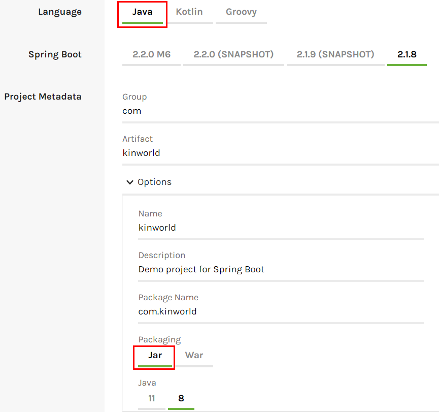
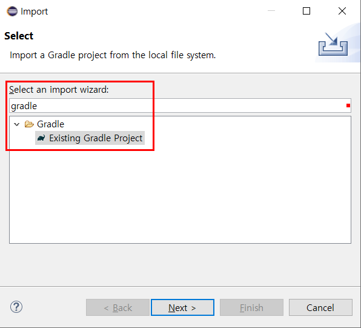
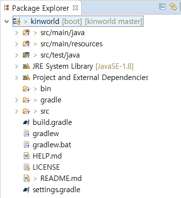
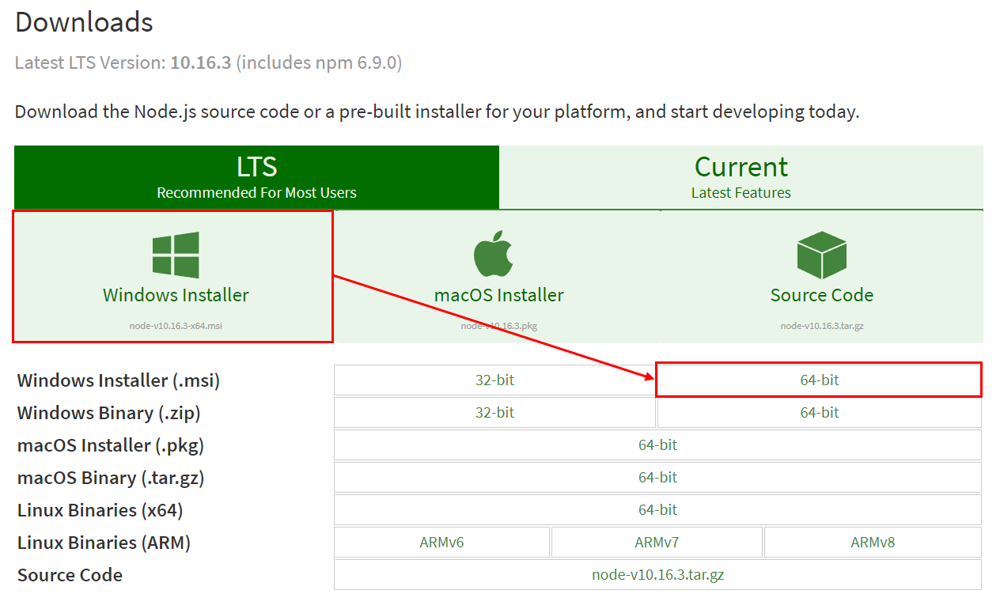
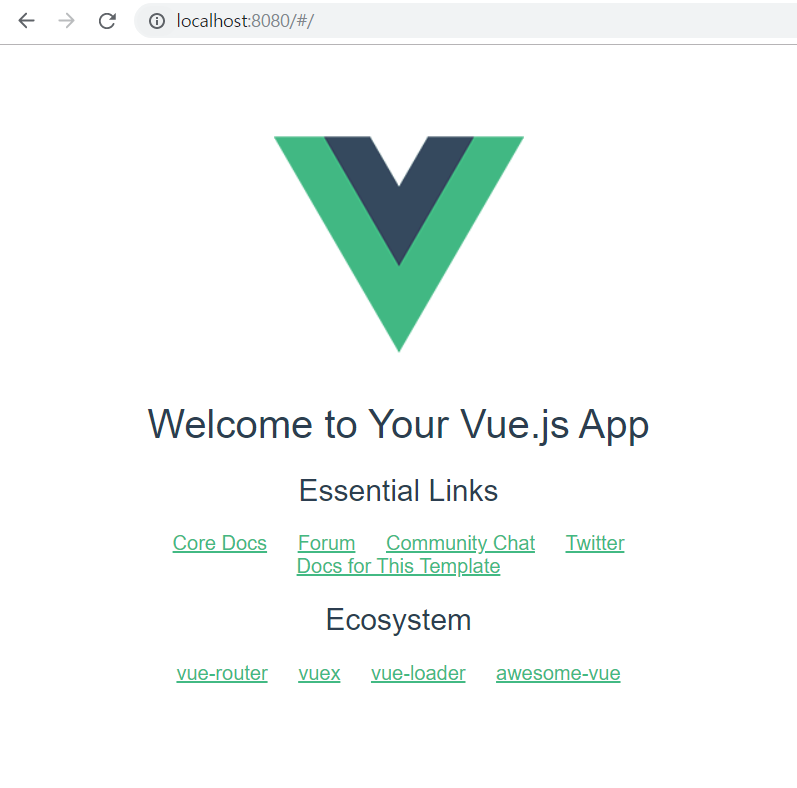

# KinWorld-Knowledge In The World
세상의 모든 지식


## INDEX

+ [I. 개발환경 - Development Envirenment](#I-개발환경-Development-Environment)
+ [II. 설정 - Setup](#II-설정-Setup)
+ [III. 레이아웃-Layout](#III-레이아웃-Layout)


## I. 개발환경-Development Environment


+ IDE : Eclipse
+ SpringBoot 2
+ Vue cli 3
+ Java
+ Gradle
+ MariaDB
+ Windows


## II. 설정-Setup

##### 1. Go to [SpringBoot Initializr](https://start.spring.io/)



##### 2. Add Dependencies

+ Spring Web
+ Thymeleaf

##### 3. Generate and Unzip

##### 4. Import Gradle Project 





##### 5.  Go to [node.js Download](https://nodejs.org/en/download/)



##### 6.  명령프롬포트 실행 1

+ Windows 

```
  npm i -g @vue/cli // vue-cli 3.x
  npm i -g vue-cli // vue-cli 2.x
```


##### 7. 환경변수 설정

+ 시스템 PATH에 ```C:\Users\유저명\AppData\Roaming\npm``` 경로 추가

##### 8.  명령프롬포트 실행

+ Move Gradle Project Directory

```
  cd kinworld
```

+ Create Project

```
	vue create '프로젝트 명' // vue-cli 3.X
    vue init webpack '프로젝트 명' // vue-cli 2.X
```

 + Build

```
    cd frontend
    npm install
    npm run build
```

##### 10. Run in local Server

```
    npm run serve // vue-cli 3.x
    npm run dev // vue-cli 2.x
```

##### 11. Create vue.config.js


```
    module.exports = {  
      outputDir: "../src/main/resources/static",  
      indexPath: "../static/index.html",  
      devServer: {  
        proxy: "http://localhost:8080"  
      },  
      chainWebpack: config => {  
        const svgRule = config.module.rule("svg");    
        svgRule.uses.clear();    
        svgRule.use("vue-svg-loader").loader("vue-svg-loader");  
      }  
    };
```

+ outputDir은 npm run build로 빌드 시 파일이 생성되는 위치
+ indexPath는 index.html 파일이 생성될 위치를 지정
+ devServer는 Back-End( Spring Boot의 내장 was의 주소)

##### 12. Maria DB Setting

```
    #datasource
    spring.datasource.driverClassName=org.mariadb.jdbc.Driver
    spring.datasource.url=jdbc:mariadb://localhost:3306/kinworld
    spring.datasource.username=root
    spring.datasource.password=password
```

##### 13. Go to http://localhost:8080/



# III. 레이아웃-Layout

##### 1. Add Vuetify

```
	npm add vuetify
```


##### 2.  Use vue-tree-nav

###### npm install --save vue-tree-nav

#####  

